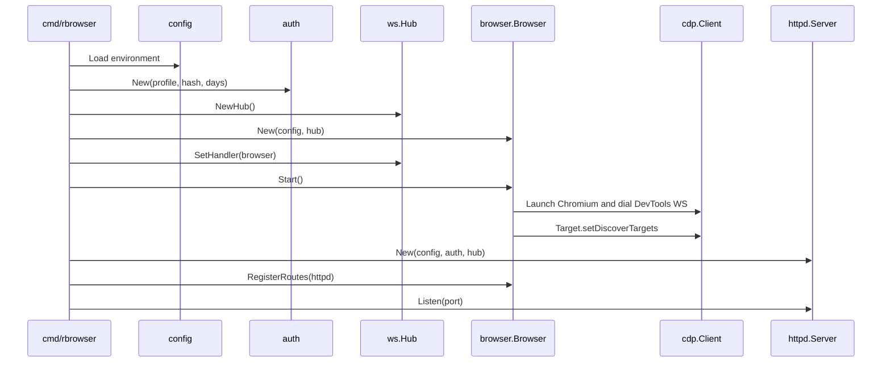
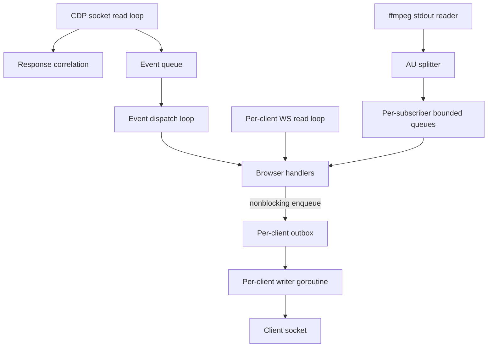

# Architecture and Repository Map

## Product shape

`rbrowser` is a **single-user remote browser appliance**, not a general browser automation grid. One server process owns one Chromium profile, discovers page targets, tracks an active tab, and broadcasts that browser state to connected clients.

Multiple clients can connect simultaneously, but they observe and control the same underlying browser session. The web and native clients are alternative heads on the same state, not isolated sessions.

## Process composition

The executable is intentionally small. `cmd/rbrowser/main.go` wires five subsystems:

1. load environment configuration;
2. initialize authentication and persistent secrets;
3. create the WebSocket hub;
4. create and start the browser coordinator;
5. start the HTTP server and register feature routes.

If Chromium or its DevTools socket dies, the process exits so the container supervisor can restart the whole appliance. This keeps recovery simple and avoids attempting to reconstruct partially valid browser/CDP state in-process.

## Package responsibilities

### `internal/config`

Defines the deployment contract. Every runtime knob is read from the environment with a safe default. It also owns two independent protocol version gates:

- `ClientVersion` for the embedded web client;
- `NativeVersion` for the Objective-C client.

Keeping the versions separate allows native-only additions without forcing the web client cache/version to move.

### `internal/auth`

Owns three related mechanisms:

- bcrypt password verification;
- an HMAC-signed, expiry-bearing HTTP cookie;
- a random WebSocket token injected into authenticated client configuration.

The HMAC secret and WS token are persisted in the Chromium profile directory, so logins and native configuration remain stable across restarts. Login attempts are rate-limited per remote IP with a small in-memory sliding window.

### `internal/httpd`

Serves:

- `/health` without authentication;
- `/login` and `/logout`;
- embedded static assets and the authenticated root page;
- `/native-config` for the native handshake;
- `/ws` with token and protocol-version validation;
- browser-registered routes such as `/downloads/` and `/tabicon/`.

The web page is loaded from the embedded filesystem and has the WS token and web client version substituted server-side. The WebSocket upgrade does not rely on browser cookies because old iOS Safari/proxy combinations are unreliable during upgrade.

### `internal/cdp`

A deliberately small Chrome DevTools Protocol client rather than a generated binding. It:

- launches Chromium with a controlled flag set;
- discovers the browser WebSocket URL from stderr or `DevToolsActivePort`;
- correlates request IDs with waiting calls;
- queues events away from the read loop;
- exposes flat target sessions.

The event queue is central to correctness: a slow event handler cannot stop CDP responses from being read and delivered.

### `internal/browser`

The main coordinator. It owns:

- Chromium page-target discovery and attachment;
- the active tab and tab metadata;
- viewport/zoom state;
- input and navigation translation;
- JPEG screencast lifecycle;
- sharp screenshot capture;
- H.264 subscription wiring;
- ad blocking, favicons, downloads, find, history, bookmarks, suggestions;
- compatibility scripts such as passkey suppression.

`Browser.mu` guards tab and view state. The key locking rule is to copy needed values under the mutex, release it, then perform CDP calls.

### `internal/ws`

Owns client connection lifecycle and transport backpressure. Each client has:

- a single writer goroutine;
- a bounded outbox for all text and binary messages;
- an independent type-1 JPEG inflight counter;
- one latest pending JPEG frame;
- native/video-mode flags.

This isolates slow sockets from the CDP and browser hot paths.

### `internal/protocol`

Defines the RBR1 binary header and the union of JSON messages clients can send. The binary header is length-prefixed and extensible. Current pixel frame types are:

- type 1: full JPEG;
- type 3: H.264 Annex-B access unit.

Type 2 is reserved for a region JPEG concept; type 4/audio appears in historical design documents but is not implemented.

### `internal/stream`

Owns the native H.264 lane:

- one ffmpeg process using `x11grab`;
- baseline-profile, zero-latency x264 output;
- Annex-B access-unit splitting on AUD NAL units;
- per-subscriber queues;
- drop-until-IDR recovery;
- lingered shutdown and bounded crash restart.

The streamer reads Xvfb directly. It does not depend on CDP and therefore naturally captures whichever tab Chromium currently displays.

### `public`

The embedded web UI. It is intentionally ES5-only and avoids modern APIs that iOS 6 Safari lacks. It handles:

- RBR1 JPEG parsing and canvas rendering;
- per-frame acknowledgements and watchdog pokes;
- touch/mouse/keyboard translation;
- local pinch preview and touch-scroll latency masking;
- tabs, omnibox, find, history, bookmarks, downloads, fullscreen, and debug UI.

### `native/client`

A UIKit Objective-C application built for a jailbroken iOS 6 device. It implements its own WebSocket over streams, shares the JSON control contract, and can switch from JPEG to H.264 video mode.

## State ownership

| State | Owner | Persistence |
|---|---|---|
| Chromium cookies/session/profile | Chromium | profile directory |
| Auth HMAC secret | `auth.Auth` | `<profile>/.authsecret` |
| WS token | `auth.Auth` | `<profile>/.wstoken` |
| Open tabs and active tab | `browser.Browser` | Chromium process lifetime/profile behavior |
| Viewport and zoom | `browser.Browser` / per tab | memory only |
| History | `browser.Store` | `<profile>/history.jsonl` |
| Bookmarks | `browser.Store` | `<profile>/bookmarks.json` |
| Downloads | Chromium + `browser.Browser` | downloads directory |
| Favicons | `browser.Browser` | memory only |
| JPEG ack/backpressure | each `ws.Client` | connection lifetime |
| Video subscriber recovery | each `stream.Sub` | subscription lifetime |

## Concurrency model

The code uses several independent synchronization domains:

- CDP request/response correlation and writes;
- CDP event queue;
- browser tab/view state;
- download name tracking;
- video subscription tracking;
- WebSocket hub client set;
- per-client JPEG window;
- streamer process/subscriber state.

Do not merge these locks casually. Their separation is what allows event delivery, socket writes, input, and encoding to make progress independently.

## Browser target model

Chromium target discovery is global. When a page target appears, `Browser`:

1. allocates a monotonically increasing local tab ID;
2. attaches with `flatten: true` to receive a session ID;
3. enables Page and Runtime domains;
4. installs compatibility scripts;
5. enables optional per-tab features;
6. navigates the first blank target to `START_URL`;
7. activates and focuses the new tab.

New tabs and OAuth popups therefore become active automatically. When an active target disappears, the newest remaining tab is selected; if no tabs remain, the server creates one.

## Security boundaries

The service is designed as a personal appliance, but its boundaries still matter:

- HTTP routes are cookie-gated except health/login/icons.
- The WebSocket requires a random token plus a matching client version.
- Passwords are compared with bcrypt.
- The auth cookie is signed and expiry-bearing, not an opaque server session.
- Download route names are reduced to a basename; hidden/path-like names are rejected.
- Suggested download names are sanitized before rename.
- Login attempts are throttled per IP.

Operationally, the server still controls a real browser profile and may expose authenticated web sessions. Treat network exposure, proxy configuration, profile volume access, and the configured password hash as sensitive.