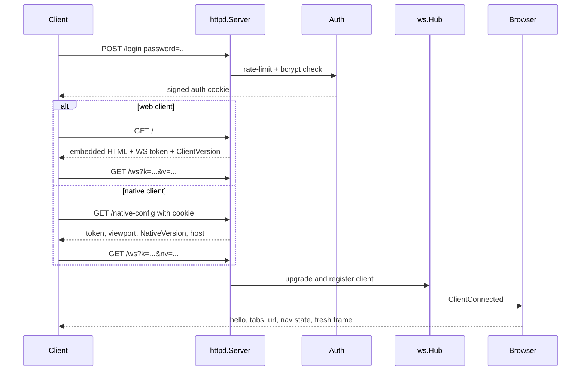
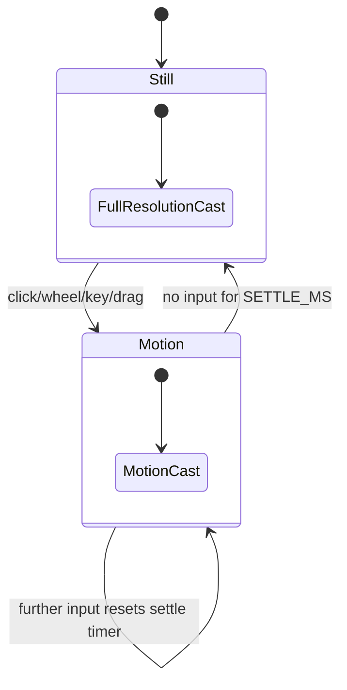
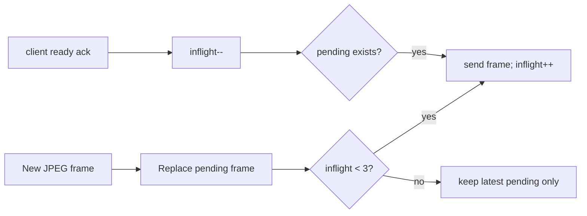
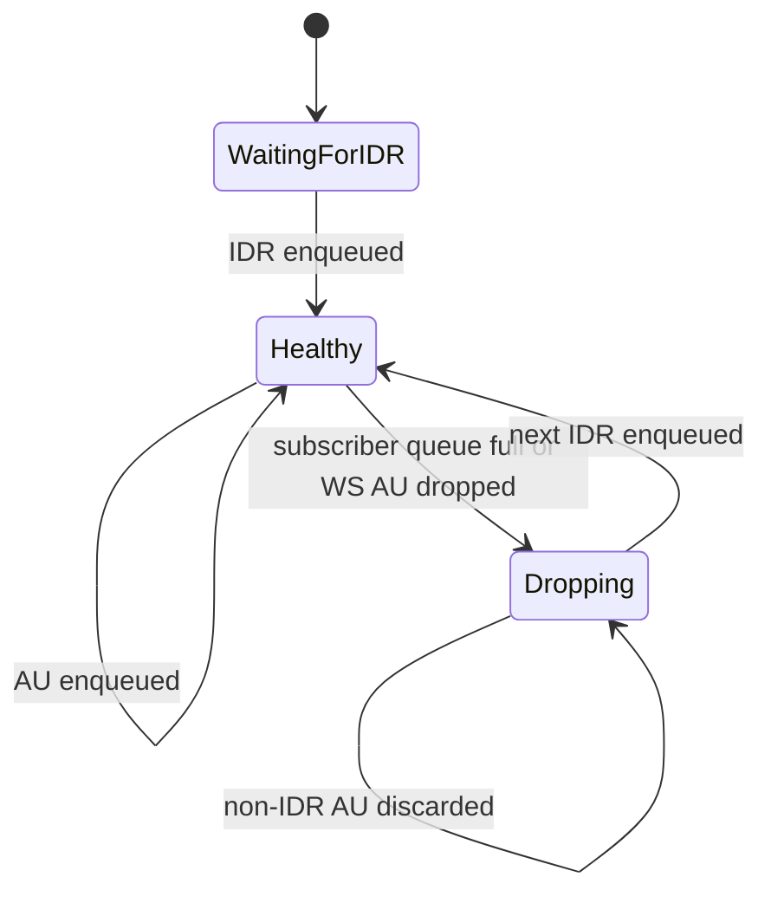

# Runtime and Data Flows

This page follows the system from startup through navigation, input, JPEG rendering, and native H.264 rendering.

## Startup and failure recovery

At startup the server launches Chromium headful under the X display prepared by `start.sh`. Chromium is given a dedicated profile and a remote-debugging endpoint on an ephemeral local port.

The CDP client finds the browser WebSocket URL in one of two ways:

1. parse Chromium's `DevTools listening on ...` stderr line;
2. fall back to `<profile>/DevToolsActivePort` and query `/json/version`.

Once connected, target discovery is enabled. Existing and future page targets enter the same attachment path. If the CDP socket closes, the top-level process exits and relies on Docker/restart policy to restore a clean Chromium/CDP/server set.

## Client connection flow



On connection, the browser sends state before waiting for new browser activity. This matters because static pages may not emit a screencast frame immediately.

## Tab lifecycle

### Creation and attachment

A `Target.targetCreated` event for a page triggers asynchronous attachment. CDP calls are intentionally moved off the event-dispatch goroutine because request interception events may need immediate continuation.

After attachment the server enables Page/Runtime, injects compatibility scripts, and optionally enables Fetch interception for ad blocking. The new target becomes active, matching browser popup behavior.

### Active-tab switch

Switching tabs performs these steps:

1. stop any settle timer on the old tab;
2. set the new active ID;
3. stop the old tab's screencast;
4. activate the Chromium target;
5. apply the current viewport and per-tab zoom;
6. ensure the new tab's screencast is running with the desired quality;
7. capture a fresh frame;
8. broadcast URL, navigation state, and tabs.

Only the active tab sends pixels. Background tabs still receive metadata updates and keep their own zoom state.

### Closure

If the active tab closes, the highest local tab ID is selected. If no page remains, a new target is created at `START_URL`.

## Navigation and browser state

Address-bar input is normalized server-side:

- an explicit URI scheme is preserved;
- a bare dotted host without spaces receives `https://`;
- other text becomes a DuckDuckGo search.

Main-frame navigation events update the active URL, history, bookmark indicator, favicon lookup, tab list, and back/forward availability. Loading start/stop events drive the client progress UI. After a load stops, the server captures a sharp frame and refreshes the favicon.

## Input coordinate model

All pointer and scroll coordinates cross the wire as viewport fractions in `[0,1]`. The server converts them to CSS pixels using the active tab's zoom-adjusted viewport:

```text
cssWidth  = physicalViewWidth  / zoom
cssHeight = physicalViewHeight / zoom
xCSS = xFraction * cssWidth
yCSS = yFraction * cssHeight
```

This prevents a resolution or quality switch in the pixel lane from changing where a touch lands.

The server translates client messages into CDP:

| Input | CDP behavior |
|---|---|
| click | mousePressed + mouseReleased, then editable-focus check |
| wheel | `Input.dispatchMouseEvent` with `mouseWheel` |
| long-press drag | persistent mouse-down, mouse moves with button held, mouse-up |
| printable text | `Input.dispatchKeyEvent` with `type: char` |
| special key | key down/up with virtual key codes |
| paste burst | `Input.insertText` |
| back/forward | navigation history lookup then `Page.navigateToHistoryEntry` |
| zoom | update device metrics and recenter scroll |

Return/Enter is special-cased to include `\r`, allowing Chromium to submit forms rather than treating it as a raw key only.

## JPEG lane

The JPEG lane combines a continuous CDP screencast with explicit screenshots.

### Motion/settle state machine



For web-only sessions, motion frames are lower quality and may be downscaled. This reduces decode cost on old Safari. When any native client is connected, motion JPEGs remain full resolution and use native-specific quality settings.

When input settles:

1. mark the tab no longer moving;
2. converge the running cast to full-resolution parameters;
3. call `Page.captureScreenshot` at `SHARP_QUALITY`;
4. send that screenshot as a sharp frame.

A sharp frame is also the one JPEG allowed through to a client in H.264 video mode. The native client uses it as a crisp text overlay after motion.

### Cast convergence

`ensureCast` is idempotent and asynchronous. It compares desired parameters with the current cast, stops/restarts only when necessary, and bounds retries/convergence iterations.

The cast is parked when there are no JPEG consumers. This occurs when no clients are connected or every connected client is in native video mode, freeing CPU for x264.

### Type-1 backpressure

Each client has a three-frame inflight window. The hub keeps only one unsent latest frame.



The client must acknowledge **every received type-1 frame**, including a frame it skips because a newer one is already waiting. Otherwise the server believes a window slot is occupied forever.

If a socket outbox is full and a JPEG write is dropped, the server returns the reserved inflight slot immediately so the lane cannot wedge waiting for an acknowledgement that will never arrive.

### Watchdog recovery

Clients send `poke` when no fresh frame arrives for a short period. The server resets that client's inflight/pending bookkeeping and sends a new screenshot. This recovers from lost acknowledgements or stale client-side render state without reconnecting.

## H.264 native video lane

Video mode is client-specific. A native client sends `{"t":"video","on":true}`; the browser subscribes it to the shared streamer.

### Encoder process

The streamer launches ffmpeg against Xvfb:

```text
x11grab -> libx264 baseline -> Annex-B H.264 on stdout
```

Important properties:

- baseline profile and `zerolatency` avoid frame reordering/lookahead;
- Access Unit Delimiters are enabled, making splitting deterministic;
- SPS/PPS are repeated at every IDR;
- IDR cadence is fixed at roughly two seconds;
- the process runs only while subscribers exist, with a short linger after the last leaves.

### Access-unit splitting

The stdout reader scans Annex-B start codes for NAL type 9 (AUD). Bytes from one AUD to the next form one complete access unit. The splitter preserves all start codes and tags an AU as IDR when it contains NAL type 5.

The splitter has a maximum assembly buffer. Exceeding it indicates lost framing and triggers encoder restart rather than unbounded memory growth.

### Subscriber backpressure

H.264 cannot use the JPEG latest-frame rule. Most P-frames depend on earlier frames.



When a subscriber queue fills—or the WebSocket outbox drops an AU—the subscription discards all subsequent non-IDR access units and resumes at the next IDR. That IDR carries fresh SPS/PPS, so the decoder can restart cleanly.

Type-3 frames bypass the type-1 JPEG acknowledgement window. Flow control is queue capacity plus IDR resynchronization.

### Video-mode transition

The first AU acts as the health gate. After receiving it, the server:

1. marks the client as in video mode;
2. sends `video-config {ok:true,fps,w,h}`;
3. forwards the first AU;
4. re-evaluates whether the JPEG cast still has consumers.

If no first AU arrives before the timeout, the client receives `video-config {ok:false}` and remains on JPEG.

Leaving video mode closes the subscription, restores JPEG delivery, ensures the cast is running, and pushes a fresh sharp frame.

### Encoder resize and crash behavior

When the viewport changes, the server best-effort resizes Xvfb with xrandr and restarts the streamer at the new coded size. Subscribers reset to wait-for-IDR state and continue on the same logical subscription.

A crash with attached subscribers is restarted once after a delay. Repeated crashes within a minute close subscribers and force clients back to JPEG instead of entering an infinite restart loop.

## Viewport and zoom

The server maintains one shared physical viewport and per-tab zoom. `Emulation.setDeviceMetricsOverride` uses:

- CSS width/height divided by zoom;
- device scale factor equal to zoom;
- a non-mobile page model.

This keeps the delivered pixel dimensions stable while rendering page content larger and sharp. Zoom commits are absolute, clamped to `1..3`, and attempt to keep the pinch focus centered by adjusting page scroll.

A viewport resize also updates the video surface. The JPEG lane only needs CDP metrics; the H.264 lane additionally needs the X display and ffmpeg coded size to track the new viewport.

## Feature flows

### Editable focus

After a click, the server waits briefly for focus to settle, evaluates the active element, and returns:

- `on` — whether it accepts text;
- `kind` — text/password/email/number/url/search/textarea/select;
- `rect` — focused element bounds as viewport fractions.

The web client primarily uses `on`; the native client also uses kind and rect to configure and position its keyboard UI.

### History and bookmarks

History is append-only JSONL in memory plus disk. Consecutive duplicate URLs collapse. Titles may be patched after navigation when Chromium reports them. Bookmarks are stored as one JSON array and are searched before history for suggestions.

### Downloads

Chromium is configured with `allowAndName`, so initial files use the download GUID. The server tracks a sanitized/deduplicated final name, renames on completion, notifies clients, and exposes the downloads directory through an authenticated route.

### Ad blocking

When enabled, each tab uses CDP Fetch interception. Request hosts are checked against an embedded domain list using parent-domain suffix matching. Matching requests fail with `BlockedByClient`; all others are explicitly continued.