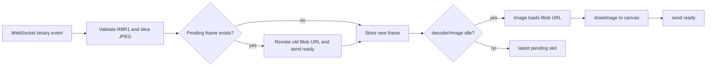

# Web and Native Clients

The two clients share browser-state and input semantics but make different implementation tradeoffs:

- the web client maximizes compatibility with iOS 6 Safari and masks latency in JavaScript/canvas;
- the native client owns its networking, decoding, UIKit, clipboard, and optional H.264 path.

## Shared behavioral contract

Both clients must:

- complete the authenticated handshake;
- send viewport size and fractional input coordinates;
- tolerate additive JSON fields;
- parse RBR1 using `headerLen`;
- acknowledge every received type-1 frame;
- reconnect without requiring server-side session reconstruction;
- render only the latest useful visual state rather than building a frame backlog.

Both control the same server-side browser. Simultaneous clients can race for input and viewport size, so the product should be treated as a personal/shared-console appliance rather than independent multi-user sessions.

# Web client

## Constraints

`public/app.js` intentionally targets ES5-era Safari. It uses:

- an immediately invoked function expression rather than modules;
- `var`, classic functions, touch events, and prefixed APIs;
- canvas plus `Image`/Blob URLs for JPEG rendering;
- a hidden input for old iOS keyboard behavior;
- no framework or build step.

Static assets are embedded into the Go binary, so deployment does not need a separate asset server.

## Frame ingestion



The client has one currently decoding image and one latest pending frame. Replacing the pending frame immediately sends the replaced frame's acknowledgement.

The canvas's intrinsic size follows encoded frame dimensions. CSS scales it into the available wrapper. This lets a half-resolution motion frame represent the full remote viewport without changing input coordinates.

## Watchdog and reconnect

If no frame arrives for roughly 1.5 seconds, the client sends `poke`. The server resets the JPEG window and produces a screenshot.

Socket close triggers exponential reconnect, capped at a modest delay. A successful open resets the attempt counter and resends viewport size.

## Touch and mouse input

The web client supports:

- tap/click;
- one-finger scroll with inertia;
- long-press word selection and drag;
- pinch zoom with a local visual preview;
- mouse and wheel fallback for desktop use.

Every pointer position is converted from the displayed canvas rectangle to viewport fractions.

### Scroll latency masking

The current web client contains local touch-scroll prediction logic described in its source header. Wheel messages are emitted while the canvas can be visually panned/reconciled against server frame scroll offsets. This is a web-specific compatibility/perception technique, not a protocol feature.

The native plan later chose not to reproduce local pan prediction because the H.264 lane provides smoother motion and avoids prediction artifacts. Treat the clients' rendering strategies as intentionally different even though their wire inputs match.

### Gesture anchoring

For a scroll gesture, wheel events keep the touch-down point as a fixed anchor. Moving the anchor with the finger can accidentally switch which nested remote element receives scroll events.

### Pinch zoom

During the gesture, a CSS transform gives instant feedback. On release the client sends an absolute server zoom and keeps the preview transform until the next server frame arrives, avoiding a snap-back/double-jump.

## Keyboard and text

A hidden input contains a sentinel character so old iOS reports backspace as a value shrink. The client emits:

- printable characters as `key{text}`;
- Return, arrows, Tab, Escape, and Backspace as down/up key messages;
- multi-character insertions as `paste{text}`.

When the server reports `editable{on:true}`, the client attempts to focus the hidden input and pulses the keyboard button as a fallback cue.

## Browser chrome

The web UI implements:

- back/forward and reload/stop;
- omnibox with loading progress and server suggestions;
- bookmark star;
- tab strip with favicons and optimistic tab selection;
- find bar;
- download/history/bookmark sheets;
- paste and copy helper sheets;
- fullscreen mode;
- debug overlay.

The debug overlay tracks socket state, buffered bytes, client version, received frames, estimated FPS, ready/poke counts, canvas size, zoom, keyboard state, and recent message types.

# Native Objective-C client

## Target and build model

The native client is a plain UIKit application for a jailbroken iOS 6 iPad. It lives under `native/client` and is built in the repository's containerized legacy toolchain. It avoids storyboards and third-party runtime dependencies.

The repository's native documents describe historical phases; the decision log records that the polished JPEG client and the H.264 video lane shipped. Audio references remain unimplemented.

## Component map

The concrete class names in `native/client/Classes` are organized around these responsibilities:

| Area | Representative classes |
|---|---|
| app/lifecycle | `RBAppDelegate`, root controller |
| configuration/session | `RBConfig`, `RBSession` |
| networking | `RBSocket` |
| wire parsing | `RBProtocol` |
| visual stream | stream view, JPEG path, `RBVideoDecoder` |
| input/keyboard | input controller and keyboard shim |
| browser chrome | root/chrome controller, `RBTabStrip`, suggestion and settings controllers |
| video parser bridge | `rb_h264.*` helpers |

Refer to actual headers and implementations for the current class map; some older docs mention planned class splits that were later consolidated.

## Threading model

The native design separates:

- a socket/run-loop thread for stream I/O and WebSocket framing;
- background decode work for JPEG;
- VideoToolbox callback/decode work for H.264;
- the main thread for UIKit, CALayer updates, and gesture decisions.

Data should cross boundaries as immutable buffers or value structs. UIKit work off-main is invalid.

## WebSocket implementation

The native app uses a hand-rolled RFC 6455 client because its target environment is old and the expected transport is simple.

It must handle:

- HTTP upgrade validation;
- masked client frames;
- unmasked server frames;
- short, 16-bit, and 64-bit payload lengths;
- fragmentation/continuation;
- ping/pong;
- close handshake;
- bounded assembly buffers;
- reconnect/backoff and native-config refresh after authorization/version failures.

The native socket and the web client must ultimately present identical JSON control semantics to the Go server.

## JPEG mode

Native JPEG mode mirrors the web delivery contract:

1. parse a type-1 RBR1 frame;
2. coalesce to one pending frame;
3. acknowledge any replaced frame;
4. decode/decompress off-main;
5. update the display layer on main;
6. acknowledge the rendered frame.

Native connections cause the server to use full-resolution motion JPEGs with native-specific quality settings. This was chosen after device testing showed the native decode path could avoid the web client's low-resolution motion compromise.

## H.264 video mode

The client opts in by sending:

```json
{"t":"video","on":true}
```

After `video-config{ok:true}`, it receives type-3 RBR1 frames containing one Annex-B access unit each. The shipped client dynamically loads VideoToolbox to avoid a link-time dependency on private/missing iOS 6 framework stubs.

The H.264 path must:

- extract/track SPS and PPS;
- establish a decoder format/session;
- accept IDR/P access units in order;
- discard/reset appropriately after failures;
- render decoded images efficiently;
- fall back to JPEG if configuration or decoding fails.

The server already protects the client from most missing-reference corruption by dropping to the next IDR after transport backpressure.

## Sharp overlay

While video mode provides fluid motion, the server still sends a sharp type-1 screenshot after interaction settles. The native stream view displays this as an overlay for crisp text and removes it when new user motion begins.

This hybrid is a key product behavior:

- H.264 optimizes motion and CPU/bandwidth efficiency;
- JPEG screenshot optimizes final text clarity.

## Native input and keyboard

The native client emits the same fractional pointer and keyboard messages as the web client. It can use UIKit capabilities unavailable to old Safari:

- keyboard type chosen from `editable.kind`;
- secure entry for password fields;
- viewport avoidance using `editable.rect`;
- real `UIPasteboard` copy/paste;
- native menus and document handoff for downloads.

The server's wire contract remains the source of truth. Native UI affordances must map to existing message types rather than inventing parallel browser commands.

## Orientation and viewport ownership

The native client sends its current stream-view dimensions at connect and rotation. The server updates:

- CDP device metrics for JPEG/page rendering;
- Xvfb best-effort screen size;
- ffmpeg coded dimensions when video mode is active.

Because the viewport is shared server state, a simultaneously connected web client may observe the native client's size change. This is expected under the current single-browser architecture.

# Client compatibility checklist

When modifying either client:

- preserve fractional coordinates;
- preserve one-ready-per-type-1-frame accounting;
- keep JSON parsing tolerant of additive fields;
- keep RBR1 parsing length-driven;
- test reconnect after a stale token/version;
- test viewport resynchronization after orientation/resize;
- test a web and native client connected simultaneously;
- verify native video failure falls back to JPEG;
- update protocol versions only for the audience affected;
- do not claim old-device behavior verified without the human device checklist.