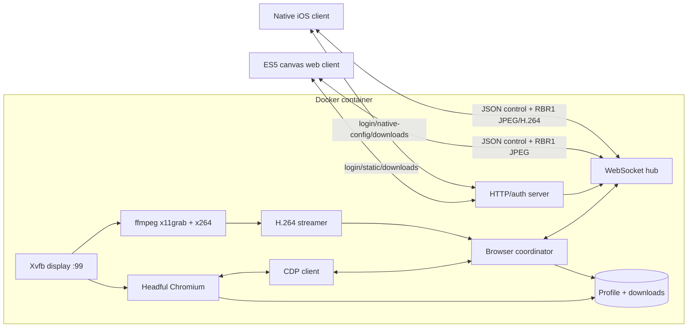

# rbrowser Deep Wiki

`rbrowser` (branded **wrp** in the clients) is a self-hosted remote browser built for old and constrained clients. A Go server launches headful Chromium inside Xvfb, controls it through the Chrome DevTools Protocol (CDP), and exposes the active page through a small authenticated HTTP/WebSocket service.

The repository contains two clients:

- an ES5/canvas web client designed to keep working in iOS 6 Safari;
- a native Objective-C iPad client that adds a hardware-decoded H.264 lane while preserving the same control protocol.

This wiki describes the implementation that exists in the repository today. When prose and code disagree, the code is authoritative.

## System at a glance



The important architectural split is between **control** and **pixels**:

- Control messages are JSON over WebSocket and are translated into CDP navigation, input, emulation, tab, and feature calls.
- The normal pixel lane is CDP `Page.screencast` JPEG plus explicit full-resolution screenshots after interaction settles.
- Native video mode bypasses CDP for pixels: ffmpeg records the X display and emits H.264 Annex-B access units.

## Reading paths

### New maintainer

1. [Architecture and repository map](01-architecture.md)
2. [Runtime and data flows](02-runtime-flows.md)
3. [Wire protocol](03-wire-protocol.md)
4. [Clients](04-clients.md)
5. [Operations and configuration](05-operations.md)
6. [Testing and maintainer guide](06-testing-maintenance.md)

### Protocol or client work

Start with [Wire protocol](03-wire-protocol.md), then read the appropriate section of [Clients](04-clients.md). The canonical implementation is:

- `internal/protocol/protocol.go`
- `internal/ws/hub.go`
- `internal/browser/*.go`
- `public/app.js`
- `native/client/Classes/RBProtocol.*`

### Performance or rendering work

Read [Runtime and data flows](02-runtime-flows.md), especially the JPEG motion/settle state machine and H.264 IDR-resync rules.

### Deployment or incident response

Read [Operations and configuration](05-operations.md), then [Testing and maintainer guide](06-testing-maintenance.md).

## Current implementation status

| Capability | Status | Main implementation |
|---|---|---|
| Password-gated web UI | Implemented | `internal/auth`, `internal/httpd` |
| Headful Chromium lifecycle | Implemented | `internal/cdp`, `internal/browser` |
| Tabs, navigation, zoom, input | Implemented | `internal/browser` |
| JPEG screencast lane | Implemented | `internal/browser/cast.go`, `internal/ws` |
| H.264 native video lane | Implemented | `internal/stream`, `internal/browser/video.go` |
| ES5/iOS 6 web client | Implemented | `public/` |
| Native iOS 6 client | Implemented | `native/client/` |
| History, bookmarks, suggestions | Implemented | `internal/browser/store.go` |
| Downloads and favicons | Implemented | `internal/browser/features.go` |
| Domain-list ad blocking | Implemented, configurable | `internal/adblock` |
| Audio lane | Not implemented; intentionally out of current scope | Historical design remains in native docs |
| Adaptive bitrate from client telemetry | Not implemented | Phase-4 idea only |

The native planning documents contain both shipped decisions and historical design notes. In particular, audio references are aspirational and should not be read as current behavior.

## Repository map

```text
cmd/rbrowser/          process entry point and dependency wiring
internal/auth/         password validation, signed cookie, WS token, rate limit
internal/config/       environment contract and protocol versions
internal/httpd/        routes, embedded assets, login and WS handshake
internal/cdp/          Chromium launch and minimal flat-session CDP client
internal/browser/      tabs, input, casting, features, persistence integration
internal/ws/           client lifecycle, outbox, frame ack/coalescing
internal/protocol/     RBR1 binary envelope and JSON message union
internal/stream/       ffmpeg H.264 process, AU splitter, subscriber backpressure
internal/adblock/      embedded domain suffix matcher
public/                embedded ES5 web client
native/client/         Objective-C iOS client
tools/nativeprobe/     native protocol and video probe
tools/icon/            icon-generation helper
native/docs/           native design, build, protocol, and test notes
Dockerfile             two-stage Go build plus Chromium/Xvfb/ffmpeg runtime
start.sh               Xvfb setup and server launch
```

## Architectural rules worth memorizing

1. Never hold `Browser.mu` across a blocking `cdp.Call`.
2. Never block the CDP response/read loop with event work.
3. All client socket writes go through one per-client outbox/writer goroutine.
4. Input coordinates on the wire are viewport fractions, not pixels.
5. Every received type-1 JPEG frame must be acknowledged, even when the client skips rendering it.
6. A dropped H.264 P-frame invalidates dependent frames; resume only at the next IDR.
7. New native-only frame types must never be sent to web clients.
8. Client-visible protocol changes require version-gate discipline.

These constraints are not style preferences. They prevent deadlocks, frozen frame pipelines, misplaced input, and corrupted video recovery.

## Canonical sources and documentation hierarchy

Use this order when resolving uncertainty:

1. executable code and tests;
2. this wiki;
3. `native/PLAN.md` decision log;
4. detailed documents under `native/docs/`.

Update the wiki when architecture, protocol semantics, operations, or shipped status changes. Update the native documents when a native-specific implementation contract changes.